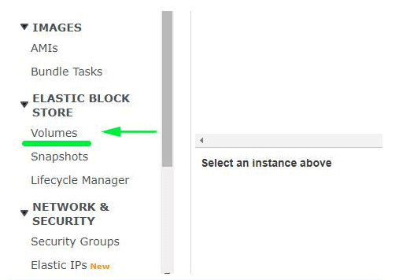

AWS ec2实例的硬盘扩容需要两步。
* 通过AWS的管理画面，扩容实例的硬盘大小。
* 从操作系统，进行扩容适配

本次从8G扩容到30G。

## AWS EBS扩容
### 从AWS的管理画面，选择要扩容的卷


### 选中卷，右键选择修改卷


### 修改卷大小，点击修改按钮


### 点击是按钮


### 关闭后等待。直到卷的状态是"in-use"时，结束。


## OS 扩容适配
1. 系统版本确认
2. 硬盘利用状况确认
3. 工具安装
4. 扩容
5. 重启
6. 文件系统适配
7. 确认

### 1. 系统版本确认
```shell 
[ec2-user ~]# cat /etc/issue
CentOS release 6.5 (Final)
Kernel \r on an \m
```

### 2. 硬盘利用状况确认
```shell
[ec2-user ~]# df -hT
Filesystem     Type   Size  Used Avail Use% Mounted on
/dev/xvda1     ext4    8G   4G  4G  50% /

[ec2-user ~]# lsblk
NAME    MAJ:MIN RM SIZE RO TYPE MOUNTPOINT
xvda    202:0    0  30G  0 disk 
└─xvda1 202:1    0  8G  0 part /
```

* 注意Type列，一般的类型有两种Ext4或者xfs，后面会用到
* 通过lsblk查看卷号，xvda1

### 3. 工具安装
推荐使用growpart

```shell 
[ec2-user ~]# yum install -y epel-release
[ec2-user ~]# yum install -y --enablerepo=epel cloud-utils-growpart
[ec2-user ~]# yum install -y --enablerepo=epel dracut-modules-growroot
```

如有如下错误
```shell 
[ec2-user ~]# yum install -y epel-release
Loaded plugins: fastestmirror, presto
Determining fastest mirrors
YumRepo Error: All mirror URLs are not using ftp, http[s] or file.
 Eg. Invalid release/repo/arch combination/
removing mirrorlist with no valid mirrors: /var/cache/yum/x86_64/6/base/mirrorlist.txt
Error: Cannot find a valid baseurl for repo: base
```

更改URL后，再次安装
```shell 
[ec2-user ~]# sed -i -e "s/^mirrorlist=http:\/\/mirrorlist.centos.org/#mirrorlist=http:\/\/mirrorlist.centos.org/g" /etc/yum.repos.d/CentOS-Base.repo
[ec2-user ~]# sed -i -e "s/^#baseurl=http:\/\/mirror.centos.org/baseurl=http:\/\/vault.centos.org/g" /etc/yum.repos.d/CentOS-Base.repo
[ec2-user ~]# yum install -y epel-release
[ec2-user ~]# yum install -y --enablerepo=epel cloud-utils-growpart
[ec2-user ~]# yum install -y --enablerepo=epel dracut-modules-growroot
```

### 4. 扩容
```shell 
[ec2-user ~]# export LANG="en_US.UTF-8"
[ec2-user ~]# growpart /dev/xvda 1
```
* 注意数字1，通过步骤2的命令查看。

### 5. 重启OS
```shell 
[ec2-user ~]# reboot
```

### 6. 文件系统适配

XFS类型时（通过步骤2查看）
```shell 
[ec2-user ~]$ xfs_growfs /dev/xvda1
```

* xfs_growfs安装
```shell 
[ec2-user ~]$ yum install -y --enablerepo=epel xfsprogs
```

ext4类型时（通过步骤2查看）
```shell 
[ec2-user ~]$ sudo resize2fs /dev/xvda1
```

### 7. 确认
```shell 
[ec2-user ~]$ df -h
Filesystem      Size  Used Avail Use% Mounted on
/dev/xvda1       30G   4G  26G  87% /
```