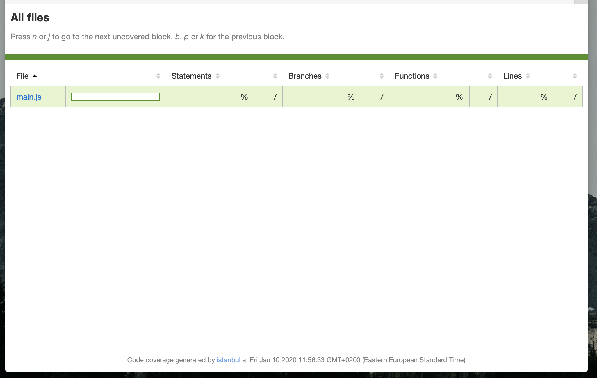

## 现象


## 原因
jest v26中使用了handlebars v4.6工具库，两个版本不兼容。

## 解决办法
### 方法1 使用handlebars v4.5.3
修改package-lock.json文件，置换handlebars的版本

```json
"handlebars": {
  "version": "4.5.3",
  "resolved": "https://registry.npmjs.org/handlebars/-/handlebars-4.5.3.tgz",
  "integrity": "sha512-3yPecJoJHK/4c6aZhSvxOyG4vJKDshV36VHp0iVCDVh7o9w2vwi3NSnL2MMPj3YdduqaBcu7cGbggJQM0br9xA==",
  "requires": {
    "neo-async": "^2.6.0",
    "optimist": "^0.6.1",
    "source-map": "^0.6.1",
    "uglify-js": "^3.1.4"
  },
  "dependencies": {
    "source-map": {
      "version": "0.6.1",
      "resolved": "https://registry.npmjs.org/source-map/-/source-map-0.6.1.tgz",
      "integrity": "sha512-UjgapumWlbMhkBgzT7Ykc5YXUT46F0iKu8SGXq0bcwP5dz/h0Plj6enJqjz1Zbq2l5WaqYnrVbwWOWMyF3F47g=="
    }
  }
},
```

### 方法2 升级jest版本
```shell script
npm install --save-dev jest
```


