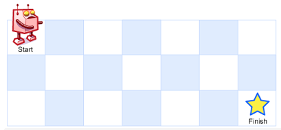

## 题目
一个机器人位于一个 m x n 网格的左上角 （起始点在下图中标记为 “Start” ）。
机器人每次只能向下或者向右移动一步。机器人试图达到网格的右下角（在下图中标记为 “Finish” ）。
问总共有多少条不同的路径？

### 示例 1：


输入：m = 3, n = 7
输出：28
### 示例 2：

输入：m = 3, n = 2
输出：3
解释：
从左上角开始，总共有 3 条路径可以到达右下角。
1. 向右 -> 向下 -> 向下
2. 向下 -> 向下 -> 向右
3. 向下 -> 向右 -> 向下
### 示例 3：

输入：m = 7, n = 3
输出：28
示例 4：

输入：m = 3, n = 3
输出：6
 

提示：

1 <= m, n <= 100
题目数据保证答案小于等于 2 * 109

[来源：力扣（LeetCode）](https://leetcode-cn.com/problems/unique-paths)


## 解题

### DA-ly-xu 
1ms 方法一,用一个数组
```java 
class Solution {
  public int uniquePaths(int m, int n) {
  	if (m <= 0 || n <= 0) {
  		return 0;
  	}
  	if (m == 1 || n == 1) {
  		return 1;
  	}

  	int[] container = new int[m];
  	Arrays.fill(container, 1);

  	for (int h = 1; h < n; h++) {
  		for (int w = 1; w < m; w++) {
  			container[w] = container[w - 1] + container[w];
  		}
  	}

  	return container[m - 1];
  }
}
```

0ms 方法二,排列组合
```java 
class Solution {
  public int uniquePaths(int m, int n) {
  	if (m < 1 || n < 1) {
  		return 0;
  	}
  	if (m == 1 || n == 1) {
  		return 1;
  	}

  	int totalStepCount = m + n - 2;

  	int shorterStep = Math.min(m, n) - 1;

  	if (shorterStep == 1) {
  		return totalStepCount;
  	}

  	int result = 1;
          // 这块写这么复杂是因为长度超过一定的时候，int 过界了，所以一边除一边组装结果
  	for (int start = 0; start < shorterStep; start++) {
  		if (start == 0) {
  			result = totalStepCount;
  		} else {
  			int topNum = totalStepCount - start;
  			int bottomNum = start + 1;

  			if (topNum % bottomNum == 0) {
  				result = result * (topNum / bottomNum);
  			} else if (result % bottomNum == 0) {
  				result = (result / bottomNum) * topNum;
  			} else {
  				result = (result * topNum) / bottomNum;
  			}
  		}

  	}
  	return result;
  }
}
```

### kojo-jotaro
```c++
class Solution {
public:
int uniquePaths(int m, int n) {
	if (m > n)
		swap(m, n);
	unsigned long long int up = 1;
	unsigned long long int down = 1;

    
	for (int i = 1; i <= m-1 ; i++)
	{
		up *= i;
	}
	for (int i = n; i <= m + n - 2; i++)
	{
		down *= i;
	}
	return down / up;
}
};
```

### xiaozhouzhou 超时
```js
/**
 * @param {number} m
 * @param {number} n
 * @return {number}
 */

function goDown(point,points,m,n) {
    var y =  point.y + 1;
    var x = point.x;
    if(y == n && x == m) {
        return 1;
    }
    if(y > n) {
        return 0;
    }else if(y == n) {
        return  goRight({x,y},[...points,{x,y}],m,n);
    }else {
        return goDown({x,y},[...points,{x,y}],m,n) + goRight({x,y},[...points,{x,y}],m,n);
    }
}
function goRight(point,points,m,n) {
    
    var x =  point.x + 1;
    var y = point.y;
    if(y == n && x == m) {
        return 1;
    }
    if(x > m) {
        return 0;
    }else if(x == m) {
        return goDown({x,y},[...points,{x,y}],m,n) ;
    }else {
        return goDown({x,y},[...points,{x,y}],m,n) + goRight({x,y},[...points,{x,y}],m,n);
    }
}

var uniquePaths = function(m, n) {
var result = 0;
var point = {};
point.y = 1;
point.x = 1;
if(1 == n && 1 == m) {
    return 1;
}
result =  result + goRight(point,[{x:1,y:1}],m,n);
result = result + goDown(point,[{x:1,y:1}],m,n);
return result;

};
```

### slsay 超时
```js
/**
 * @param {number} m
 * @param {number} n
 * @return {number}
 */
var uniquePaths = function(m, n) {
   let result = 0;
   let i = 0;
   const recr = (x, y) => {
        if ((x === m - 1) && (y === n -1) ) {
            result += 1;
        }

        if ((x + 1) < m) recr(x + 1, y); // down
        if ((y + 1) < n) recr(x, y + 1); // right

       i += 1;
   };
   recr(0, 0);
   return result;
};
```

### fangq78
```java
class Solution {
    public int uniquePaths(int m, int n) {
        int[][] map = new int[m][n];
        for(int i=0;i<n;i++) {
            map[0][i] = 1;
        }
        for(int i=0;i<m;i++) {
            map[i][0] = 1;
        }
        for (int i = 1; i < m; i++) {
            for (int j = 1; j < n; j++) {
                map[i][j] = map[i][j - 1] + map[i - 1][j];
            }
        }
        return map[m - 1][n - 1];
    }
}
```