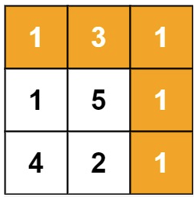

## 题目
给定一个包含非负整数的 m x n 网格 grid ，请找出一条从左上角到右下角的路径，使得路径上的数字总和为最小。

说明：每次只能向下或者向右移动一步。

示例 1：


输入：grid = [[1,3,1],[1,5,1],[4,2,1]]
输出：7
解释：因为路径 1→3→1→1→1 的总和最小。
示例 2：

输入：grid = [[1,2,3],[4,5,6]]
输出：12
 

提示：

m == grid.length
n == grid[i].length
1 <= m, n <= 200
0 <= grid[i][j] <= 100


[来源：力扣（LeetCode）](https://leetcode-cn.com/problems/minimum-path-sum)

## 解题

### slsay
题解1 超时

```js
/**
 * @param {number[][]} grid
 * @return {number}
 */
var minPathSum = function(grid) {
   let result = Number.MAX_VALUE;

   const m = grid.length;
   const n = grid[0] ? grid[0].length : 0;

   const recr = (x, y, sum, log) => {
       if (x > m) return;
       if (y > n) return;
       sum += grid[x][y];
       log += `${grid[x][y]}(${x}, ${y})→`
       if ((x === m - 1) && (y === n -1) ) {
           console.log(log, sum);
           result = Math.min(sum, result);
       }

       if ((x + 1) < m) recr(x + 1, y, sum, log);
       if ((y + 1) < n) recr(x, y + 1, sum, log);
   };

   recr(0, 0, 0, '');
   return result;
};

```


题解2 76ms

```js
/**
 * @param {number[][]} grid
 * @return {number}
 */
var minPathSum = function(grid) {
   for (let i = 0, rowLen = grid.length; i < rowLen; i++) {
        for (let j = 0, colLen = grid[i].length; j < colLen; j++) {
            if (i === 0 && j === 0) continue;
            if ((i - 1) < 0 ) {
                grid[i][j] += grid[i][j - 1];
                continue;
            }
            if ((j - 1) < 0 ) {
                grid[i][j] += grid[i - 1][j];
                continue;
            }
            grid[i][j] += Math.min(grid[i - 1][j], grid[i][j - 1]);
        }
   }
   return grid[grid.length - 1][grid[grid.length - 1].length - 1];
};
```


### dutLyuyu
```js
/**
 * @param {number[][]} grid
 * @return {number}
 */

const min = (a, b) => (a > b? b : a);

const initArray = (rows, lines) =>{
  const r = [];
  for(let i = 0; i < rows; i++){
    r[i] = new Array(lines);
  }
  return r;
};

var minPathSum = function(grid) {
  const r = initArray(grid.length, grid[0].length);

  const fn = (row, line ) => {
    if(typeof r[row][line] === 'number'){
      return r[row][line];
    }

    if(row === 0 && line === 0){
      r[row][line] = grid[0][0];
      return r[row][line];
    }

    if(row === 0 && line !== 0){
      r[row][line] = fn(row, line - 1) + grid[row][line];
      return r[row][line];
    }

    if(row !== 0 && line === 0){
      r[row][line] = fn(row - 1, line) + grid[row][line];
      return r[row][line];
    }

    r[row][line] = min(fn(row, line - 1), fn(row - 1, line)) + grid[row][line];
    return r[row][line];
  };

   return fn(grid.length - 1, grid[0].length - 1);
};
```

### xiaozhouzhou
```js
/**
 * @param {number[][]} grid
 * @return {number}
 */
var minPathSum = function(grid) {
  
    var n = grid[0].length;
    var m = grid.length;
    for(var i = 0;i<m; i++) {
        for(var j=0;j<n; j++) {
            if(i<1) {
                if(j<1) {
                    continue;
                }else {
                    grid[i][j] = grid[i][j-1] + + grid[i][j];
                }
            }else if(j<1) {
                grid[i][j] = grid[i-1][j] + grid[i][j];
            }else {
                grid[i][j] = Math.min(grid[i-1][j],grid[i][j-1]) + grid[i][j];
            }
            
        }
    }
    return grid[m-1][n-1];
};
```

### DA-ly-xu 1ms
```java
class Solution {
 public int minPathSum(int[][] grid) {
 	if (grid == null) {
 		return 0;
 	}
 	if (grid.length == 0) {
 		return 0;
 	}
 	if (grid[0].length == 0) {
 		return 0;
 	}

 	int[] stepContainer = new int[grid[0].length];

 	for (int i = 0; i < stepContainer.length; i++) {
 		if (i > 0) {
 			stepContainer[i] = stepContainer[i - 1] + grid[0][i];
 		} else {
 			stepContainer[i] = grid[0][i];
 		}
 	}

 	for (int n = 1; n < grid.length; n++) {
 		for (int m = 0; m < stepContainer.length; m++) {
 			stepContainer[m] = (m == 0 ? grid[n][m] + stepContainer[m]
 					: grid[n][m] + Math.min(stepContainer[m - 1], stepContainer[m]));
 		}
 	}

 	return stepContainer[stepContainer.length - 1];
 }
}
```

### Aria486 90ms
```js
var minPathSum = function(grid) {
    let row = grid.length;
    let col = grid[0].length;

    for(let i = 1; i < row; i++) {
      grid[i][0] += grid[i - 1][0];
    }
        

    for(let j = 1; j < col; j++) {
      grid[0][j] += grid[0][j - 1];
    }
        

    for(let i = 1; i < row; i++) {
      for(let j = 1; j < col; j++) {
        grid[i][j] += Math.min(grid[i - 1][j], grid[i][j - 1]);
      } 
    }
        
    return grid[row - 1][col - 1]
};
```

### fangq78
```java
class Solution {
    public int minPathSum(int[][] grid) {
        if (grid == null || grid.length == 0 || grid[0].length == 0) {
            return 0;
        }
        int rows = grid.length, columns = grid[0].length;
        int[][] dp = new int[rows][columns];
        dp[0][0] = grid[0][0];
        for (int i = 1; i < rows; i++) {
            dp[i][0] = dp[i - 1][0] + grid[i][0];
        }
        for (int j = 1; j < columns; j++) {
            dp[0][j] = dp[0][j - 1] + grid[0][j];
        }
        for (int i = 1; i < rows; i++) {
            for (int j = 1; j < columns; j++) {
                dp[i][j] = Math.min(dp[i - 1][j], dp[i][j - 1]) + grid[i][j];
            }
        }
        return dp[rows - 1][columns - 1];
    }
}
```