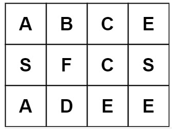

## 题目
给定一个 m x n 二维字符网格 board 和一个字符串单词 word 。如果 word 存在于网格中，返回 true ；否则，返回 false 。

单词必须按照字母顺序，通过相邻的单元格内的字母构成，其中“相邻”单元格是那些水平相邻或垂直相邻的单元格。同一个单元格内的字母不允许被重复使用。


### 示例 1：


输入：board = [["A","B","C","E"],["S","F","C","S"],["A","D","E","E"]], word = "ABCCED"
输出：true
### 示例 2：


输入：board = [["A","B","C","E"],["S","F","C","S"],["A","D","E","E"]], word = "SEE"
输出：true
### 示例 3：


输入：board = [["A","B","C","E"],["S","F","C","S"],["A","D","E","E"]], word = "ABCB"
输出：false
 

提示：

m == board.length
n = board[i].length
1 <= m, n <= 6
1 <= word.length <= 15
board 和 word 仅由大小写英文字母组成
 

进阶：你可以使用搜索剪枝的技术来优化解决方案，使其在 board 更大的情况下可以更快解决问题？

[来源：力扣（LeetCode）](https://leetcode-cn.com/problems/word-search)

## 解题

### xiaozhouzhou 超时
```js
/**
 * @param {character[][]} board
 * @param {string} word
 * @return {boolean}
 */

function find(board,i,j,word,targetIndex,map) {
    var result1 = false;
    var result2 = false;
    var result3 = false;
    var result4 = false;
    if(targetIndex == word.length -1) {
        return true;
    }else {
        if(i > 0) {
            if(!map.includes((i-1)+""+j) && word[targetIndex+1] == board[i-1][j]) {
                var newMap = [...map];
                newMap.push((i-1)+""+j);
                //console.log((i-1)+""+j);
                if(targetIndex+1 == word.length -1 ) {
                    result1 =  true;
                }else {
                    result1 =  find(board,i-1,j,word,targetIndex+1,newMap);
                }

                
            }
        }
        if(i +1<  board.length) {
            if(!map.includes((i+1)+""+j) && word[targetIndex+1] == board[i+1][j]) {
                var newMap = [...map];
                newMap.push((i+1)+""+j);
                //console.log((i+1)+""+j);
                if(targetIndex+1 == word.length -1 ) {
                    result4 =  true;
                }else {
                    result4 =  find(board,i+1,j,word,targetIndex+1,newMap);
                }
                
            }
        }
        if(j > 0) {
            if(!map.includes(i+""+(j-1)) && word[targetIndex+1] == board[i][j-1]) {
                var newMap = [...map];
                newMap.push(i+""+(j-1));
                //console.log((i)+""+(j-1));
                if(targetIndex+1 == word.length -1 ) {
                    result2 =  true;
                }else {
                    result2 =  find(board,i,j-1,word,targetIndex+1,newMap);
                }

                
            }
        }
        if(j +1<  board[0].length) {
            if(!map.includes(i+""+(j+1)) && word[targetIndex+1] == board[i][j+1]) {
                var newMap = [...map];
                newMap.push(i+""+(j+1));
                //console.log((i)+""+(j+1));
                if(targetIndex+1 == word.length -1 ) {
                    result3 =  true;
                }else {
                    result3 =  find(board,i,j+1,word,targetIndex+1,newMap);
                }
                
            }
        }
        return result1 || result2 || result3 || result4;
    }
    
}
var exist = function(board, word) {
    for(var i = 0;i<board.length;i++) {
        for(var j = 0;j<board[0].length;j++) {
            if(board[i][j] == word[0]) {
                if(find(board,i,j,word,0,[i+""+j])) {
                    return true;
                }else {
                    continue;
                }
            }
        }
    }
    return false;
};
```

### kojo-jotaro 超时
```js
class Point {
public:
    char title;
    int x;
    int y;
    Point(int a,int b){
        x=a;
        y=b;
    }
};

class Solution {
public:
    bool exist(vector<vector<char>>& board, string word) {
        vector<vector<Point>> word_table;
        word_table.resize(26);

        int mid;
        vector<Point> point_list;
        bool flage=false;

        for(int i=0;i<board.size();i++){
            for(int j=0;j<board[i].size();j++){
                mid=board[i][j];
                if(mid<97){
                    Point point(i,j);
                    word_table[mid-65].push_back(point);
                } else{
                    Point point(i,j);
                    word_table[mid-97].push_back(point);
                }
            }
        };
        
        flage=func(point_list,word_table,0,0,word);
        return flage;
    }
    bool func(vector<Point>& point_list,vector<vector<Point>>& word_table,int i,int k,string word){
        if(word.length()==point_list.size()) return true;
        cout<<"--------"<<endl;
        cout<<"i:"<<i<<" ";;
        cout<<"point_list.size()"<<point_list.size()<<endl;
        int mid=word[i++];
        bool flage=false;
        if(mid<97&&mid>64) mid=mid-65;
        else if(mid>96&&mid<123)mid=mid-97;
        else return flage;
        cout<<"mid:"<<mid<<endl;
                
        for(int j=0;j<word_table[mid].size();){ 
            if(point_list.size()==0){ 
                point_list.push_back(word_table[mid][0]);
                word_table[mid].erase(word_table[mid].begin(),word_table[mid].begin()+1);
                flage=func(point_list,word_table,i,0,word);
                        if(flage==false){
                            point_list.pop_back();
                            cout<<"size:"<<point_list.size()<<endl;
                            continue;
                        } else return flage;
            } else{
                int x1=point_list[k].x;
                int x2=word_table[mid][j].x;
                int y1=point_list[k].y;
                int y2=word_table[mid][j].y;
                cout<<"point_list[k]:"<<point_list[k].x<<","<<point_list[k].y<<" k:"<<k<<endl;
                cout<<"word_table[mid][j]:"<<word_table[mid][j].x<<","<<word_table[mid][j].y<<endl;
                j++;
                if(x1==x2||y1==y2){
                    if(x1-x2==-1||x1-x2==1||y1-y2==-1||y1-y2==1){
                        point_list.push_back(word_table[mid][j]);
                        if(j<word_table[mid].size())
                            word_table[mid].erase(word_table[mid].begin()+j,word_table[mid].begin()+j+1);
                        else
                            return true;
                        flage=func(point_list,word_table,i,k+1,word);
                        if(flage==false){
                            point_list.pop_back();
                            continue;
                        } else return flage;
                    } else{
                        j++
                        continue;
                    }

                }
                
            
            }
        }
        return flage;
    }
};
```

### dutLyuyu 112ms
```js
var exist = function(board, word) {
  let hor = board[0].length;
  let ver = board.length;
  let wlen = word.length;

  let result = false;

  // board[x,y] = word[0]
  let count = 0;
  const fn = (x, y) => {
    if(x > -1 && x < ver && y > -1 && y < hor && board[x][y] === word[count]){
      if(count < wlen-1) {
        const tmp = board[x][y];
        board[x][y] = '#';
        count++;
        const rs = fn(x + 1, y) || fn(x - 1, y) || fn(x, y - 1) || fn(x, y + 1);
        board[x][y] = tmp;
        if(!rs){
          count--;
        }
        return rs;
      }else {
          // only when count === wlen-1
        count++;
        return true;
      }
    }else{
      return false;
    }
  };

  for(let x=0;x<ver;x++){
    for(let y=0;y< hor;y++){
      if(result){
        break;
      }

      if(board[x][y] === word[0]){
        result = result || fn(x, y);
      }
    }
  }
  return result;
};
```