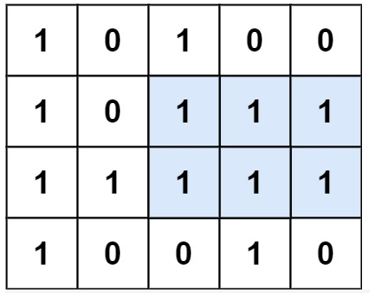

## 题目
给定一个仅包含 0 和 1 、大小为 rows x cols 的二维二进制矩阵，找出只包含 1 的最大矩形，并返回其面积。

### 示例 1：

输入：matrix = [["1","0","1","0","0"],["1","0","1","1","1"],["1","1","1","1","1"],["1","0","0","1","0"]]
输出：6
解释：最大矩形如上图所示。
### 示例 2：

输入：matrix = []
输出：0
### 示例 3：

输入：matrix = [["0"]]
输出：0
### 示例 4：

输入：matrix = [["1"]]
输出：1
### 示例 5：

输入：matrix = [["0","0"]]
输出：0
 

提示：

rows == matrix.length
cols == matrix[0].length
0 <= row, cols <= 200
matrix[i][j] 为 '0' 或 '1'

[来源：力扣（LeetCode）](https://leetcode-cn.com/problems/maximal-rectangle)

## 解题

### slsay 104ms
```js
/**
 * @param {character[][]} matrix
 * @return {number}
 */
var maximalRectangle = function(matrix) {
    const largestRectangleArea = (heights) => {
        let maxArea = 0
        const stack = []
        heights = [0, ...heights, 0]         
        for (let i = 0; i < heights.length; i++) { 
            while (heights[i] < heights[stack[stack.length - 1]]) {
            const stackTopIndex = stack.pop()
            maxArea = Math.max(
                maxArea,
                heights[stackTopIndex] * (i - stack[stack.length - 1] - 1)
            )
            }
            stack.push(i) 
        }
        return maxArea
    }

    let result = 0;
    for (let i = 0, len = matrix.length; i < len; i ++) {
      for(let j = 0, jLen = matrix[i].length; j < jLen; j++) {
         matrix[i][j] = matrix[i-1] && matrix[i][j] > 0 ? (matrix[i-1][j] + (+matrix[i][j])) : +matrix[i][j];
      }
      result = Math.max(result, largestRectangleArea(matrix[i]));
    }
    return result;

};
```

### xiaozhouzhou 216ms
```js
    /**
 * @param {character[][]} matrix
 * @return {number}
 */
var handleStack  = function(heights,stack,height,heigthIndex,max) {
    if(heights[stack[stack.length -1]] > height) {
        var popT = stack.pop();
        max.value = max.value < heights[popT] * (heigthIndex - stack[stack.length -1] -1) ? heights[popT] * (heigthIndex - stack[stack.length -1] -1) : max.value;
        handleStack(heights,stack,height,heigthIndex,max);
    }else {
        stack.push(heigthIndex);
    }
} 
var largestRectangleArea = function(heights) {
    heights =  [0,...heights,0];
    var stack = [];
    var max = {value:0};
    for(var index in heights) {
        if(stack.length == 0) {
            stack.push(index);
        }else {
            handleStack(heights,stack,heights[index],index,max);
        }
    }
    return max.value;
};
var maximalRectangle = function(matrix) {
    var height = [];
    var max =0;
    if(matrix.length > 0) {
        height = new Array(matrix[0].length).fill(0);
        for(var i = 0 ;i< matrix.length ;i++) {
            for(var j = 0 ;j< matrix[i].length ;j++) {
                if(matrix[i][j] == 0) {
                    height[j] = 0;
                }else  {
                    height[j] ++;
                }
            }
            console.log(height);
            var temp = largestRectangleArea(height);
            max = temp > max ? temp :max;
        }
    }
    return max;
};
```

### dutLyuyu
```js
const IncreStack = {
    val: [],
    // 空栈栈顶和pop 结果返回undefined
    top: function(){
        return this.val[this.val.length - 1];
    },
    pop: function(){
        return this.val.pop();
    }
};

/**
 * @param {number[]} heights
 * @return {number}
 */
var largestRectangleArea = function(heights) {
    let re = 0;

    // 矩阵后各添加一个height为0的矩阵
    // increStrack 存的是index
    // 但是单调栈维护 以heights为准
    const increStack = Object.create(IncreStack);
    heights.push(0);

    const updateResult = (comingIndex) => {
        const cur = increStack.pop();
        // 栈里面前一个数、也就是下一个栈顶
        let pre = increStack.top() === undefined ? - 1 : increStack.top();
        let tmp = (comingIndex - pre - 1) * heights[cur];
        re = re > tmp ? re : tmp;
        return pre;
    };

    increStack.val = [0];
    for(let i = 1; i < heights.length; i++){
        let top = increStack.top();
        while(heights[i] < heights[top]){
            top = updateResult(i);
        }
        if(top === -1 || heights[i] > heights[top]){
            increStack.val.push(i);
        }else if(heights[i] === heights[top]){
            // !!
            increStack.val[increStack.val.length - 1] = i;
        }
    }
    return re;
};

/**
 * @param {string[][]} matrix
 * @return {number}
 */
var maximalRectangle = function(matrix) {
    if(matrix.length < 1 ){
        return 0;
    }
    const iMax = matrix.length;
    const jMax = matrix[0].length
    let re = 0;
    for(let i = 0; i < iMax; i++){
        for(let j = 0; j < jMax; j++){
            if(i === 0){
                matrix[i][j] = +matrix[i][j];
            }else {
                if(matrix[i][j] === "0"){
                    matrix[i][j] = 0;
                } else {
                    matrix[i][j] = (+matrix[i][j]) + matrix[i-1][j];
                }
            }

        }
        let tmp = largestRectangleArea(matrix[i]);
        re = re > tmp? re : tmp;
    }
    return re;
};
```

### kojo-jotaro 168ms
```js
/**
 * @param {character[][]} matrix
 * @return {number}
 */
var maximalRectangle = function(matrix) {
    let content = new Array();
    for(let i =0;i<matrix.length;i++){
        content[i] = new Array();
        for(let j=0;j<matrix[0].length;j++){
            content[i][j]=matrix[i][j]==='1'?true:false;
        }
    }
    let result =0;
    for(let i=0;i<matrix.length;i++){
        let j=i;
        let mid = content[i];
        while(j<matrix.length){
            for(let a=0;a<mid.length;a++){
                mid[a] = mid[a] && content[j][a];
            }

            if(!mid.includes(true)) break;

            let width = 0;
            let cur = mid.concat();
            while(cur.includes(true)){
                width++;
                for(let a=0;a< cur.length;a++){
                    cur[a]=cur[a]&&cur[a+1];
                }
            }
            midResult = width*(j-i+1);
            result = Math.max(result,midResult)
            j++;
        }
    }
    return result;
};
```