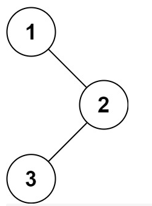
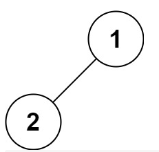
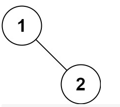

## 题目
给定一个二叉树的根节点 root ，返回它的 中序 遍历。

### 示例 1：


输入：root = [1,null,2,3]
输出：[1,3,2]
### 示例 2：

输入：root = []
输出：[]
### 示例 3：
输入：root = [1]
输出：[1]

### 示例 4：


输入：root = [1,2]
输出：[2,1]
### 示例 5：


输入：root = [1,null,2]
输出：[1,2]
 
提示：
树中节点数目在范围 [0, 100] 内
-100 <= Node.val <= 100
 

进阶: 递归算法很简单，你可以通过迭代算法完成吗？

[来源：力扣（LeetCode）](https://leetcode-cn.com/problems/binary-tree-inorder-traversal)


## 解题
### slsay 80ms
```js
var inorderTraversal = function(root) {
   const result = [];
   const ldr = (node) => {
       if (!node) return;
       ldr(node.left)
       result.push(node.val);
       ldr(node.right);
   }
   ldr(root);
   return result;
};
```

### dutLyuyu
```js
var inorderTraversal = function(root) {
    const re = [];
    const loop = (root)=>{
        if(root !== null){
            loop(root.left);
            re.push(root.val);
            loop(root.right);
        }
    }
    loop(root);
    return re;
};
```

### Aria486 90ms
```js
var inorderTraversal = (root) => {
  let result = []
  const loop = (node) => {
    if(node) {
      loop(node.left);
      result.push(node.val);
      loop(node.right);
    }
  }
  loop(root)
  return result
};
```