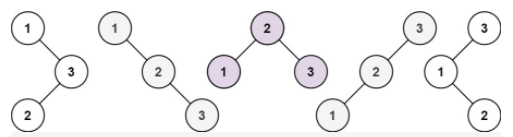
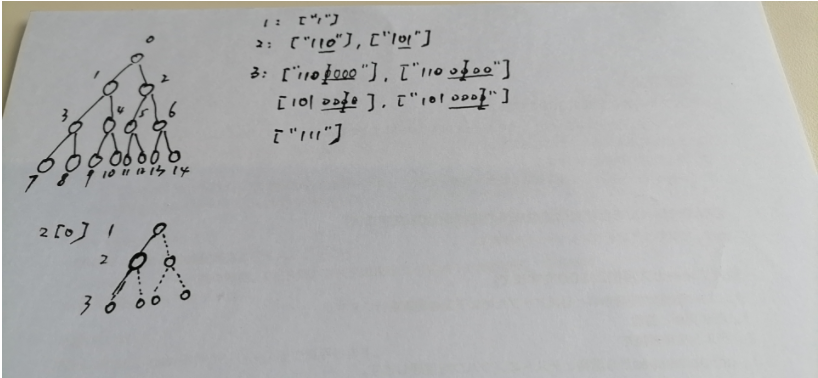

## 题目
给你一个整数 n ，求恰由 n 个节点组成且节点值从 1 到 n 互不相同的 二叉搜索树 有多少种？返回满足题意的二叉搜索树的种数。

示例 1：


输入：n = 3
输出：5
示例 2：

输入：n = 1
输出：1
 
提示：
1 <= n <= 19

[来源：力扣（LeetCode）](https://leetcode-cn.com/problems/unique-binary-search-trees)

## 解题

### dutLyuyu
80ms
```js
/**
 * @param {number} n
 * @return {number}
 */
// left < root < right
var numTrees = function(n) {
    const store = [1, 2];
        for (let i = 3; i <= n; i++) {
            let result = 0;
            for (let j = 1;  j<= i; j++) {
                // 以 j 为顶点的时候
                result += (store[j-1 -1] || 1) *  (store[i - (j+1)] || 1)
            }
            store[i-1] = result;
        }
       
        return store[n-1];
   
};
```

3364ms
```js
/**
 * @param {number} n
 * @return {number}
 */
var numTrees = function(n) {
    
    const loop = (start, end) => {
        if(end - start === 0){
            return 1;
        } else if(end - start === 1){
            return 2;
        }
        let count = 0;
        for(let root = start; root <= end; root++){
            if(root === start){
                count += loop(start + 1, end);
            } else if(root === end){
                count += loop(start, end - 1);
            } else {
                count += loop(start, root - 1) * loop(root + 1, end);
            }
        }
        return count;
    }

   return loop(1, n);
};
```

### Aria486 4600ms
```js
const numTrees = (n) => {
  if (n == 0 || n == 1) {
    return 1;
  }
  let result = 0;
  for (let i = 0; i <= n - 1; i++) {
    result += numTrees(i) * numTrees(n - i - 1);
  }
  return result;
};
```

### wangkexu1986 0ms
```swift
class Solution {
    func numTrees(_ n: Int) -> Int {
        if n == 1 {
            return 1
        }
        if n == 2 {
            return 2
        }
    
        var dp = Array(repeating: 0, count: n + 1)
        dp[0] = 1
        dp[1] = 1
        for i in 2...n {
            for j in 1...i {
                dp[i] += dp[j - 1] * dp[i - j]
            }
        }
        return dp[n]
    }
}
```

### xiaozhouzhou 
4536ms
```js
/**
 * @param {number} n
 * @return {number}
 */

var count = function(start,end) {
    if(end <= start) {
        return 1;
    }else {
        var sum = 0;
        for(var i= start;i<=end;i++) {
            sum += count(start,i-1)*count(i+1,end);
        }
        return sum;
    }
}
var numTrees = function(n) {
    return count(1,n);
};
```

68ms
```js
/**
 * @param {number} n
 * @return {number}
 */
var map= {};
var count = function(start,end) {
    var key = start+"-"+end;
    if(map[key]) {
        return map[key];
    }
    if(end <= start) {
        return 1;
    }else {
        var sum = 0;
        for(var i= start;i<=end;i++) {
            sum += count(start,i-1)*count(i+1,end);
        }
        
        map[key] = sum;
        return sum;
    }
}
var numTrees = function(n) {
    return count(1,n);
};
```

### slsay
```js
/**
 * @param {number} n
 * @return {number}
 */
var numTrees = function(n) {
   if (n < 1) return 0;
   let result = ["1"];

   const replacePos = (strObj, pos, replacetext) => {
        const str = strObj.substr(0, pos) + replacetext + strObj.substring(pos+1, strObj.length);
        return str;
   }
   const debug = false;
   for (let i = 2; i <= n; i++) {
        const tempArray = {};
        for (let j = 0; j < result.length; j++) {
            const rj = Math.log2(result[j].length + 1); // 层数
            const start =  Math.pow(2, rj - 1) - 1; // 每层的开始位置
            const nextFloorArr = Array(Math.pow(2, rj)).fill(0).join(''); // 下层的节点数
            
            for (let k = start; k < result[j].length; k++) {
                if (result[j][k] === '1') {
                    const currentFloor = result[j] + nextFloorArr;

                    // left
                    const left = replacePos(currentFloor, 2 * k + 1, '1');
                    tempArray[left] = 1;
                    debug && console.log(currentFloor, left, rj, k, 2 * k + 1);

                    // right
                    const right = replacePos(currentFloor, 2 * k + 2, '1');
                    tempArray[right] = 1;
                    debug && console.log(currentFloor, right, rj, k, 2 * k + 2);
                } else {
                    // 父节点必须 = 1
                    if (result[j][(k - 1) / 2] === '1' || result[j][(k - 2) / 2] === '1') {
                        // result[j][k] = '1';
                        const orgin = replacePos(result[j], k, '1');
                        tempArray[orgin] = 1;
                        debug && console.log(result[j], orgin, rj, k, 'a');
                    }
                }
            }
        }
        result = Object.keys(tempArray);
   }

   return result.length;
};
```

