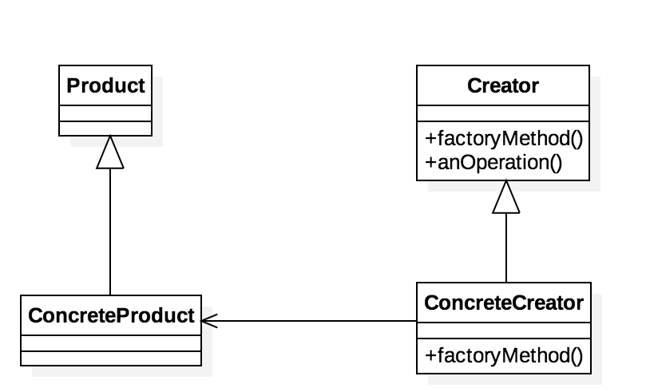
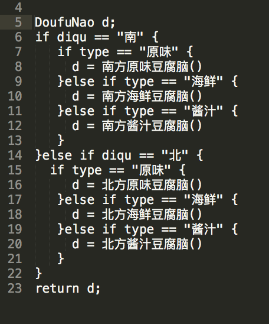
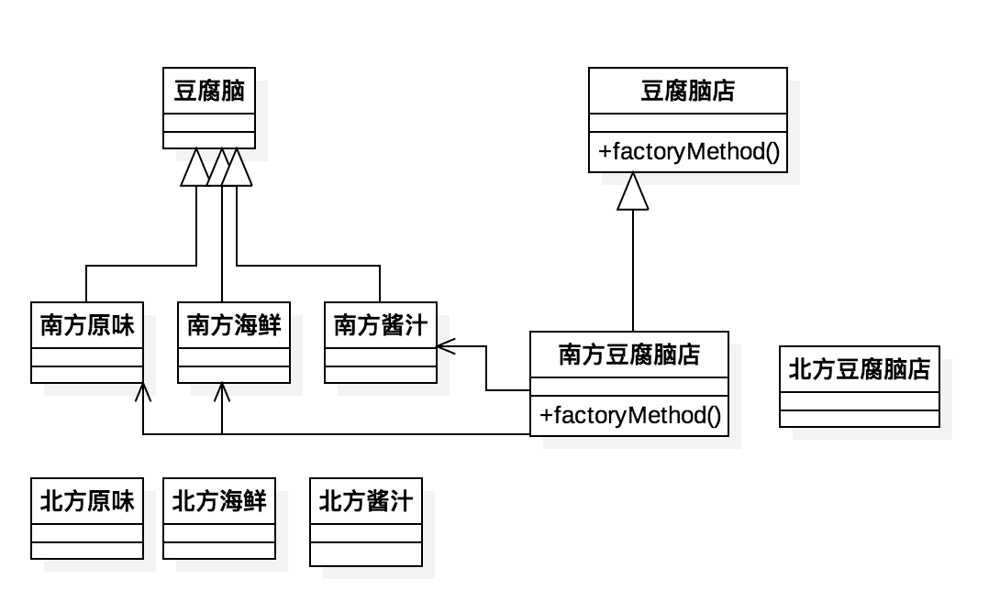
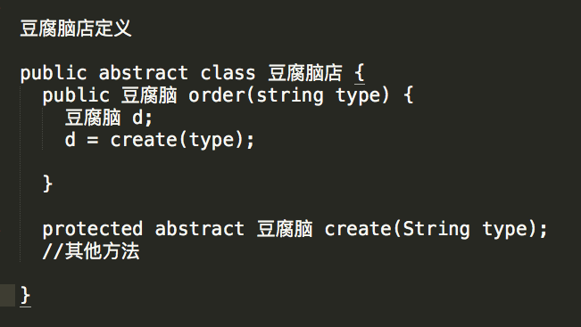

# 工厂方法模式的定义
定义了一个创建对象的接口,但由子类决定要实例化的类是哪一个.工厂方法让类把实例化推迟到子类.
# 类图

# 工厂模式的例子
假设我们有一个豆腐脑店,店里有原味的,海鲜口味的和酱汁口味的豆腐脑.考虑到南北方的差异,原味豆腐脑
可能需要甜口或者咸口的.
最简单的实现方式可能是这样:

# 运用工厂模式的豆腐脑店

# 豆腐脑店的实现

# 工厂模式的优点
* 在工厂方法模式中，工厂方法用来创建客户所需要的产品，同时还向客户隐藏了哪种具体产品类将被实例化这一细节，用户只需要关心所需产品对应的工厂，无须关心创建细节，甚至无须知道具体产品类的类名。
* 基于工厂角色和产品角色的多态性设计是工厂方法模式的关键。它能够使工厂可以自主确定创建何种产品对象，而如何创建这个对象的细节则完全封装在具体工厂内部。工厂方法模式之所以又被称为多态工厂模式，是因为所有的具体工厂类都具有同一抽象父类。
* 使用工厂方法模式的另一个优点是在系统中加入新产品时，无须修改抽象工厂和抽象产品提供的接口，无须修改客户端，也无须修改其他的具体工厂和具体产品，而只要添加一个具体工厂和具体产品就可以了。这样，系统的可扩展性也就变得非常好，完全符合“开闭原则”。
# 工厂模式的缺点
* 在添加新产品时，需要编写新的具体产品类，而且还要提供与之对应的具体工厂类，系统中类的个数将成对增加，在一定程度上增加了系统的复杂度，有更多的类需要编译和运行，会给系统带来一些额外的开销。
* 由于考虑到系统的可扩展性，需要引入抽象层，在客户端代码中均使用抽象层进行定义，增加了系统的抽象性和理解难度.
# 适用环境
* 一个类不知道它所需要的对象的类：在工厂方法模式中，客户端不需要知道具体产品类的类名，只需要知道所对应的工厂即可，具体的产品对象由具体工厂类创建；客户端需要知道创建具体产品的工厂类。
* 一个类通过其子类来指定创建哪个对象：在工厂方法模式中，对于抽象工厂类只需要提供一个创建产品的接口，而由其子类来确定具体要创建的对象，利用面向对象的多态性和[里氏替换原则](https://baike.baidu.com/item/%E9%87%8C%E6%B0%8F%E4%BB%A3%E6%8D%A2%E5%8E%9F%E5%88%99)，在程序运行时，子类对象将覆盖父类对象，从而使得系统更容易扩展。
* 将创建对象的任务委托给多个工厂子类中的某一个，客户端在使用时可以无须关心是哪一个工厂子类创建产品子类，需要时再动态指定，可将具体工厂类的类名存储在配置文件或数据库中。
